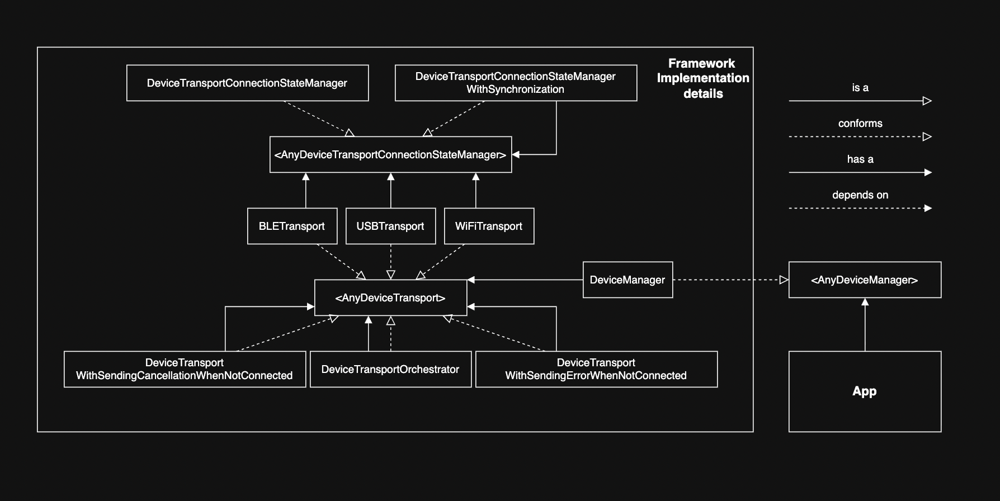

# FlipperDevicesInc-MultiTransportConnectivityLayer-TestTask
Multi-Transport Connectivity Layer for IoT Device | Test Task

    Hi, dear reviewers! 👋
    Before reading this, check out the Dependency Diagram inside this folder (drawio/png).

## Protocol/Class documentation

### AnyDeviceTransportConnectionStateManager

A protocol for storing and updating the connection state.
It is used by BLETransport, USBTransport, WiFiTransport to eliminate duplicated logic.

- DeviceTransportConnectionStateManager an implementation of AnyDeviceTransportConnectionStateManager. 
It has pure logic with no side effects

- DeviceTransportConnectionStateManagerWithSynchronization a decorator for AnyDeviceTransportConnectionStateManager 
that synchronizes updates of the connection status.
Example: connect() -> status is connecting -> disconnect() -> connectTask gets cancelled -> status gets disconnected

### AnyDeviceTransport

A protocol for transport logic.

- BLETransport an implementation of AnyDeviceTransport.
Mock BLE layer.

- USBTransport an implementation of AnyDeviceTransport.
Mock USB layer.

- WiFiTransport an implementation of AnyDeviceTransport.
Mock WiFi layer.

- DeviceTransportWithSendingErrorWhenNotConnected a decorator for AnyDeviceTransport that fails initiated send requests 
when the connection state is not connected.
Example: state is not connected -> try sendRequest() -> sendRequestTask immediately fails

- DeviceTransportWithSendingCancellationWhenNotConnected a decorator for AnyDeviceTransport 
that cancels pending send requests when the connection state gets disconnected/failed.
Example: sendRequest() -> sending is in progress -> status gets disconnected -> sendRequestTask gets cancelled

- DeviceTransportOrchestrator a decorator for AnyDeviceTransport that manages a fallback AnyDeviceTransport
when the primary connects with an error.
Example: state is not connected -> try primary.connect() fails -> try fallback.connect() 

### AnyDeviceManager

A protocol that execute device operations.

- DeviceManager an implementation of AnyDeviceManager. Uses AnyDeviceTransport to work.

## Key design decisions explained

- iOS 18 for Mutex from the Synchronization framework. It's possible to create a custom implementation for lower versions, 
but I decided to avoid it. Actors are great to protect shared mutable state from data races in concurrent code. 
But they can't be used everywhere. It's possible to ignore swift concurrency restrictions using `nonisolated(unsafe) var` 
or `@unchecked Sendable`, but Mutex is just better and easy to use.

- Decorators are used to add side effects without changing the pure logic in implementations.
They are compact, easy to test and can be easily turned off if necessary.

- POP. Each implementation conforms to a specific protocol.
It's used in order to inject protocol dependencies that can be easily mocked.

## Commit History

https://github.com/sharojke/FlipperDevicesInc-MultiTransportConnectivityLayer-TestTask
